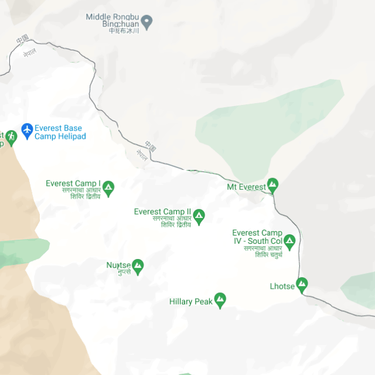
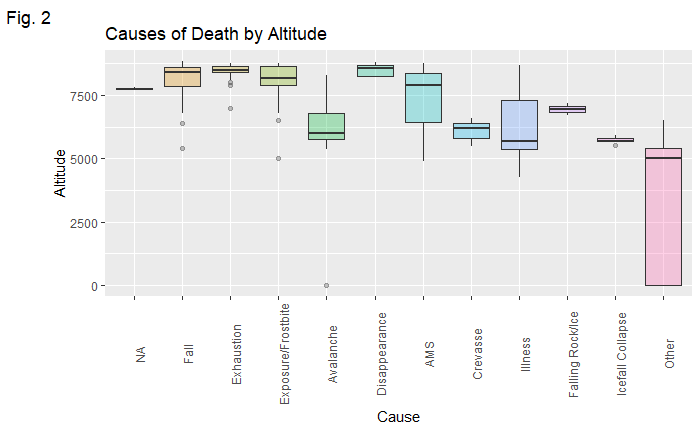
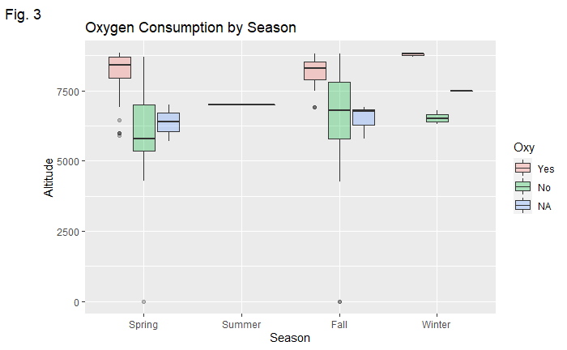
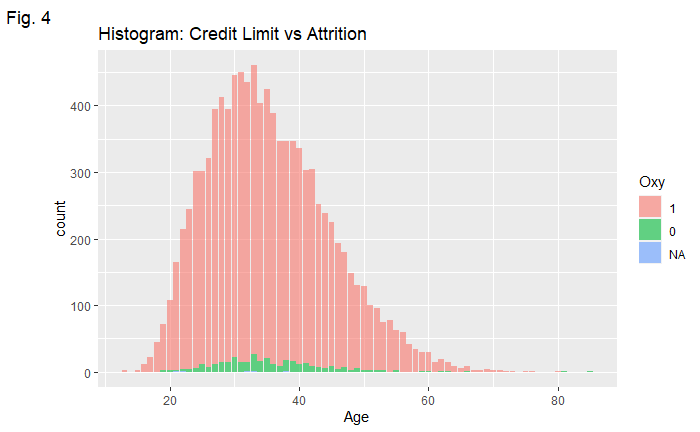
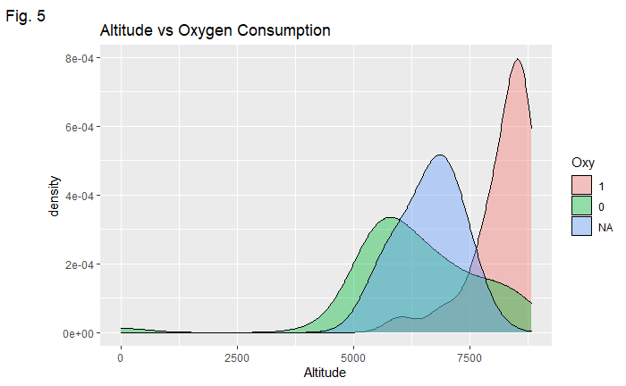
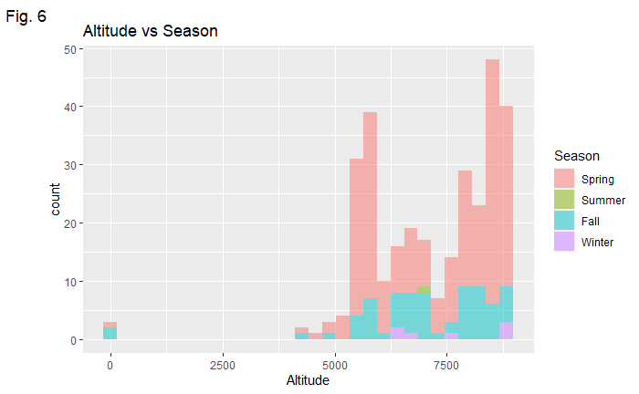

<table><tr><td style="text-align: center;"><canvas id="canvas_tt61ae5d0ea1acf" width="125" height="125"></canvas></td></tr>
<tr><td style="text-align: center; font-weight: bold"><a href="http://24timezones.com/current_local/nepal_time.php" style="text-decoration: none" class="clock24" id="tz24-1638817038-cc14350-eyJiZ2NvbG9yIjoiNjYwMDk5IiwibGFuZyI6ImVuIiwidHlwZSI6ImEiLCJzaXplIjoiMTI1IiwiY2FudmFzX2lkIjoiY2FudmFzX3R0NjFhZTVkMGVhMWFjZiJ9" title="Time in Nepal" target="_blank">Time in Nepal</a></td></tr>
</table>
<script type="text/javascript" src="//w.24timezones.com/l.js" async></script>

Nepal^[https://24timezones.com/Nepal/time] is tomorrow~
```{r setup, set.seed(1), include=FALSE}
knitr::opts_chunk$set(error = TRUE, cache = TRUE, warning = FALSE)
library(tidyverse)
library(readr)
library(readxl)
library(caret)
library(xaringan)
library(xaringanExtra)
library(dplyr)
library(knitr)
library(hrbrthemes)
library(gplots)
library(xaringan)
library(xaringanExtra)
library(sknifedatar)
library(kableExtra)
xaringanExtra::use_panelset()
xaringanExtra::style_panelset_tabs()

mt_everest_total <- read_csv("data/mt_everest_total.csv", 
    col_types = cols(Name = col_skip(), `Yr/Seas` = col_skip(), 
        Year = col_factor(levels = c()), 
        Season = col_factor(levels = c()), 
        Date = col_skip(), Month = col_number(), 
        Time = col_factor(levels = c()), 
        Citizenship = col_factor(levels = c()), 
        Sex = col_factor(levels = c()), Age = col_number(), 
        Oxy = col_factor(levels = c()), Ascents = col_factor(levels = c()), 
        Dth = col_factor(levels = c()), Host = col_factor(levels = c()), 
        Cause = col_factor(levels = c()), 
        Altitude = col_number()))
save(mt_everest_total, file = "EverestTotal.Rda")
total <- mt_everest_total
total1 <- total
View(total)
summary(total)
```
# Map



# Dataset
I got two datasets, peak ascents and deaths reports for Everest from [The Himalayan Database](https://www.himalayandatabase.com/index.html){target="_blank"} and combined them into one dataset. Most other online databases only provide one or two recent year data for free, and I didn't find more available data, so this dataset has limited variables for analysis. Probably could add some weather data like daily wind speed and average temperature as predictors. 👉[National Geographic](https://www.nationalgeographic.org/projects/perpetual-planet/everest/weather-data/){target="_blank"}

something is wrong here, NA is more than 215, and the totals are not equal?

```{r}
NA_cnt <- table(is.na(total))
NA_pct <- prop.table(NA_cnt)
cbind(NA_cnt, NA_pct)

total <- VIM::kNN(total, 
                  variable = c("Age", "Oxy"),
                  k = 10)
total <- total[, -c(15:16)]
table(is.na(total))

counts <- table(total$Dth)
proportions <- prop.table(counts)
cbind(counts, proportions)
```

# Plots

::: panelset
::: panel
[Age]{.panel-name} Male climbers' age range is wider than females due to some outliers. We can see the oldest climbers are over 80. 50% of death in females are between the age of 30-50 while males are between 30-45. Both genders' interquartile ranges are similar among success ascents groups. 

```{r plot1}
ggplot(data = total, 
       mapping = aes(x = Sex,
                     y = Age,
                     fill = Dth), na.rm = TRUE) +
  labs(x = "Sex",
       y = "Age",
       title = "Age Distribution by Sex and Death",
       tag = "Fig. 1") +
  geom_boxplot(alpha = .3)
```
:::

::: panel
[Causes]{.panel-name} More people died the altitude below 7500m because of natural disasters compared to the altitude above 7500m. Death zone^[https://en.wikipedia.org/wiki/Death_zone] is defined as an altitude above 8000m, which can cause mountaineers to lose physical strength or even vital functions due to a low level of concentration of oxygen. I guess I could add some ratio variables for the death rates in different altitude zones? Like death zone and Khumbu Icefall?

 =(Had issues with some columns even though I had already removed the missing values and it did work when I ran the chunk individually. However, it did not work when I knit the whole post. 😩

```{r plot2}
total %>% 
  drop_na(Altitude) %>% 
  ggplot(mapping = aes(x = Cause,
                       y = Altitude,
                       fill = Cause)) +
  labs(title = "Causes of Death by Altitude",
       tag = "Fig. 2") +
  geom_boxplot(alpha = .3) +
  theme(legend.position = "none",
        axis.text.x = element_text(angle = 90))
```
:::

::: panel
[Oxy]{.panel-name} 


```{r plot3}
order <- c(1, 2, 3, 4) 
total %>% 
  drop_na(Altitude) %>% 
  ggplot(mapping = aes(x = factor(Season, level = order),
                       y = Altitude,
                       fill = Oxy)) +
  labs(title = "Oxygen Consumption by Season",
       x = "Season",
       tag = "Fig. 3") +
  geom_boxplot(alpha = .3) +
  scale_x_discrete(labels = c("1" = "Spring", "2" = "Summer", "3" = "Fall", "4" = "Winter")) +
  scale_fill_discrete(labels = c("Yes", "No", "NA"))
```
:::

::: panel
[Oxy by Age]{.panel-name} Most climbers are between 25-45 years old


```{r plot4}
total %>% 
  drop_na(Age) %>% 
  ggplot(mapping = aes(x = Age,
                     fill = Oxy)) +
  geom_histogram(position = "stack",
                 alpha = .6,
                 stat="count") +
  labs(title = "Histogram: Credit Limit vs Attrition",
       tag = "Fig. 4")
```
:::

::: panel
[Oxy by Altitude]{.panel-name} Higher consumption of oxygen above 7500m altitude.


```{r plot5}
total %>% 
  drop_na(Altitude) %>% 
  ggplot(mapping = aes(x = Altitude,
                       group = Oxy,
                       fill = Oxy)) +
  geom_density(adjust = 1.5, alpha = .4) +
  labs(title = "Altitude vs Oxygen Consumption",
       tag = "Fig. 5")
```
:::

::: panel
[Season]{.panel-name} Most expeditions happened in spring and some in the fall


```{r plot6}
order <- c(1, 2, 3, 4)
total %>% 
  drop_na(Altitude) %>% 
  ggplot(mapping = aes(x = Altitude,
                       fill = factor(Season, level = order))) +
  geom_histogram(position = "stack",
                 alpha = .5) +
  labs(title = "Altitude vs Season",
       tag = "Fig. 6") +
  scale_fill_discrete(name = "Season", labels = c("Spring", "Summer", "Fall", "Winter"))
```
:::
:::

# Result
```{r comparison}
comparison <- matrix(c(0.9199, 0.2818, 0.6264, 0.9287, 
                       0.9327, 0.3152, 0.6044, 0.9426, 
                       0.9503, 0.3963, 0.6154, 0.9604),
                     ncol = 4, byrow = TRUE)
colnames(comparison) <- c("Accuracy", "Kappa", "Recall", "Sepecificity")
rownames(comparison) <- c("i.SMOTE", "ii.UP", "iii.DOWN")
comparison <- as.data.frame.matrix(comparison)
kable(comparison) %>% 
  row_spec(3, color = "white", background = "#bdaeea")
  
```
# Code

## i. My logistic regression does not work=(

```{r glm}
index <- createDataPartition(total1$Dth, p = .7, list = FALSE, times = 1)

train <- total1[index,]
test <- total1[-index,]

glm <- train(
  form = Dth ~ Age + factor(Oxy),
  data = train,
  trContrl =trainControl(method = "cv", number = 10),
  method = "glm",
  family = "binomial",
  na.action = na.omit
)
```

## ii. knn with SMOTE 

```{r smote}
knn1 <- train( 
  Dth ~ factor(Season) + factor(Sex) + Age + factor(Oxy),
  data = train,
  method = "knn",
  trControl = trainControl(method = "cv", number = 10,
                           sampling = "smote"),
  preProcess = c("center", "scale"),
  tuneLength = 10,
  na.action = na.omit
)

plot(knn1)
knn1$bestTune

pred1 <- predict(knn1, test)
confusionMatrix(pred1, test$Dth,
                positive = "1")
```

## iii. knn with Up  

```{r up}
knn3 <- train( 
  Dth ~ factor(Season) + factor(Sex) + Age + factor(Oxy),
  data = train,
  method = "knn",
  trControl = trainControl(method = "cv", number = 10,
                           sampling = "up"),
  preProcess = c("center", "scale"),
  tuneLength = 10
)

plot(knn3)
knn3$bestTune

pred3 <- predict(knn3, test)
confusionMatrix(pred3, test$Dth,
                positive = "1")
```

## iv. knn with Down 

```{r down}
knn4 <- train( 
  Dth ~ factor(Season) + factor(Sex) + Age + factor(Oxy),
  data = train,
  method = "knn",
  trControl = trainControl(method = "cv", number = 10,
                           sampling = "down"),
  preProcess = c("center", "scale"),
  tuneLength = 10,
  na.action = na.omit
)

plot(knn4)
knn4$bestTune

pred4 <- predict(knn4, test)
confusionMatrix(pred4, test$Dth,
                positive = "1")
```

R.I.P all the bodies and Hillary Step